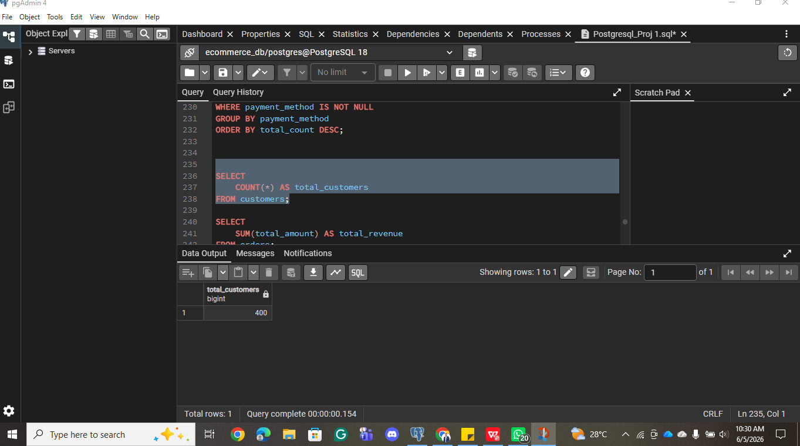
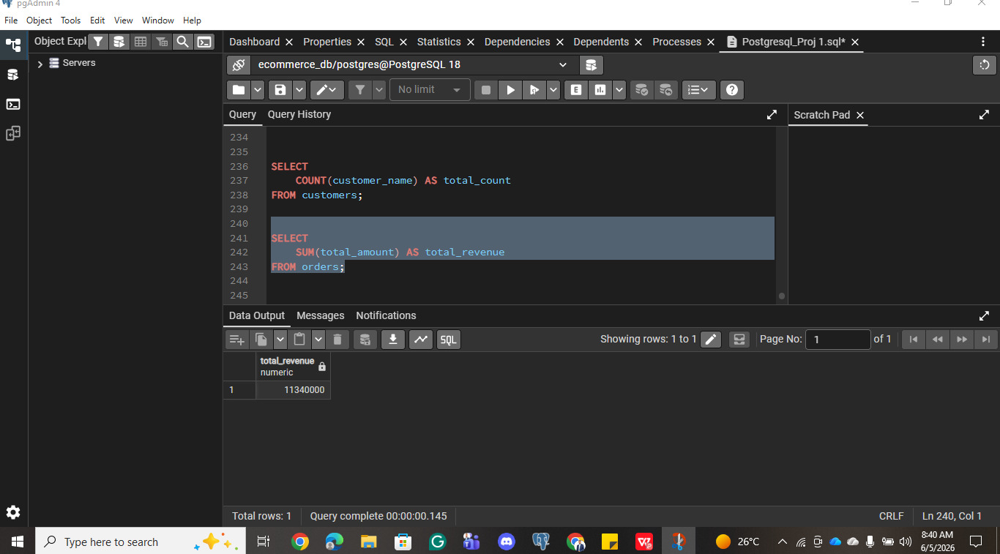
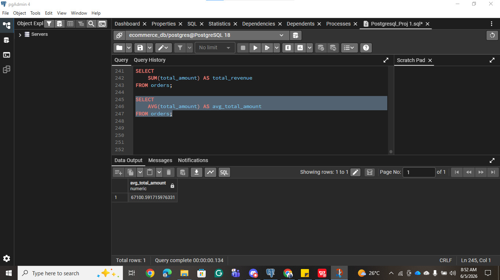
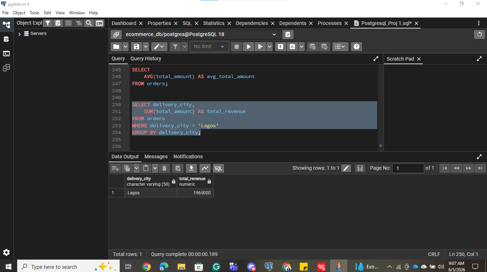
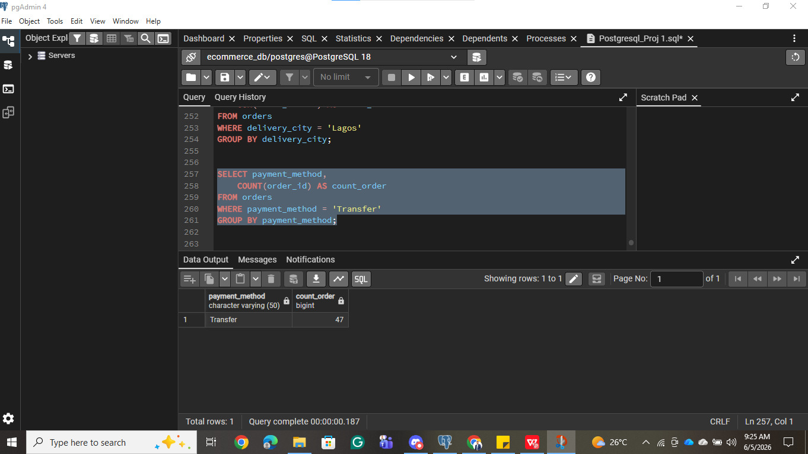

# E-Commerce Aggregate Analysis (SQL)

Using SQL aggregate functions in PostgreSQL (pgAdmin 4) to answer key business questions about revenue, order volume, and payment behavior for an e-commerce dataset.

## Project Overview

This project builds on the same e-commerce customer and order dataset used in the [ecommerce-sql-analysis](../ecommerce-sql-analysis) project, this time focusing on aggregate functions (`COUNT`, `SUM`, `AVG`) combined with `GROUP BY` and `WHERE` to answer revenue and performance questions a finance or business team would actually ask.

**Tools used:** PostgreSQL, pgAdmin 4

## The Data

- **Customers dataset:** `data/ecommerce_customers.csv` — customer records (customer_id, customer_name, email, phone_number, city, gender, signup_date)
- **Orders dataset:** `data/ecommerce_orders.csv` — order records (order_id, customer_id, product_name, quantity, price, total_amount, payment_method, order_date, delivery_city)

## Queries & Business Questions

All queries are in [`ecommerce_aggregate_queries.sql`](ecommerce_aggregate_queries.sql).

### 1. Total number of customers
```sql
SELECT
    COUNT(*) AS total_customers
FROM customers;
```


**Result:** 400 total customers.

### 2. Total revenue from all orders
```sql
SELECT
    SUM(total_amount) AS total_revenue
FROM orders;
```


**Result:** ₦11,340,000 in total revenue.

### 3. Average order amount
```sql
SELECT
    AVG(total_amount) AS avg_total_amount
FROM orders;
```


**Result:** Average order value of ~₦67,100.

### 4. Total revenue from Lagos orders
```sql
SELECT delivery_city,
    SUM(total_amount) AS total_revenue
FROM orders
WHERE delivery_city = 'Lagos'
GROUP BY delivery_city;
```


**Result:** ₦1,965,000 in revenue from Lagos deliveries.

### 5. Number of orders paid via Transfer
```sql
SELECT payment_method,
    COUNT(order_id) AS count_order
FROM orders
WHERE payment_method = 'Transfer'
GROUP BY payment_method;
```


**Result:** 47 orders paid via Transfer.

### 6. Business question — Card payment
